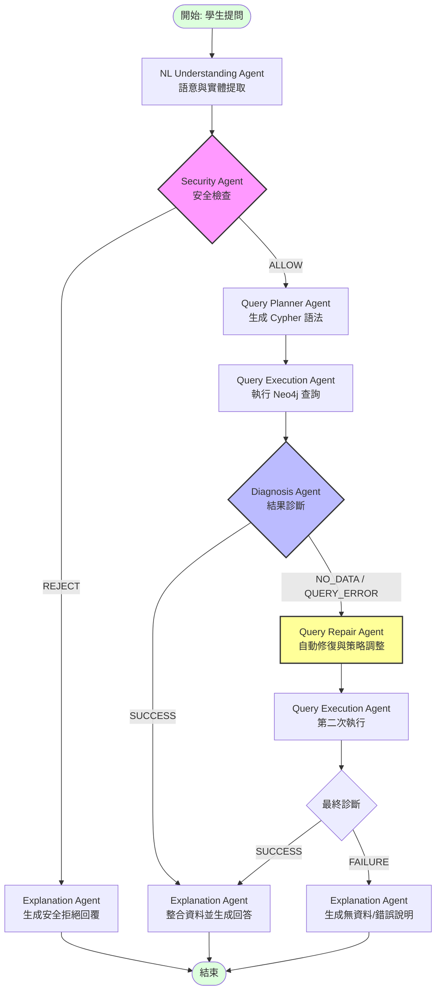

# KG-Multi-Agent-QA-System

## Architecture Diagram

---
### 3. 架構圖重點說明
*   **Security First**：所有問題在進入資料庫前，都會經過 Security Agent 掃描，確保符合 **Read-only** 規範並過濾不當內容。
*   **Two-Stage Retrieval**：
    *   第一層：透過 NLU 提取的關鍵字進行精確搜尋。
    *   第二層：若初次失敗，**Repair Agent** 會將策略轉向模糊搜尋或語意擴張（例如從「轉系」擴大到「學則」內容）。
*   **Self-Healing Loop**：系統具備自我修復能力，能夠識別 Cypher 語法錯誤或空結果，並在用戶無感的情況下完成修復。
