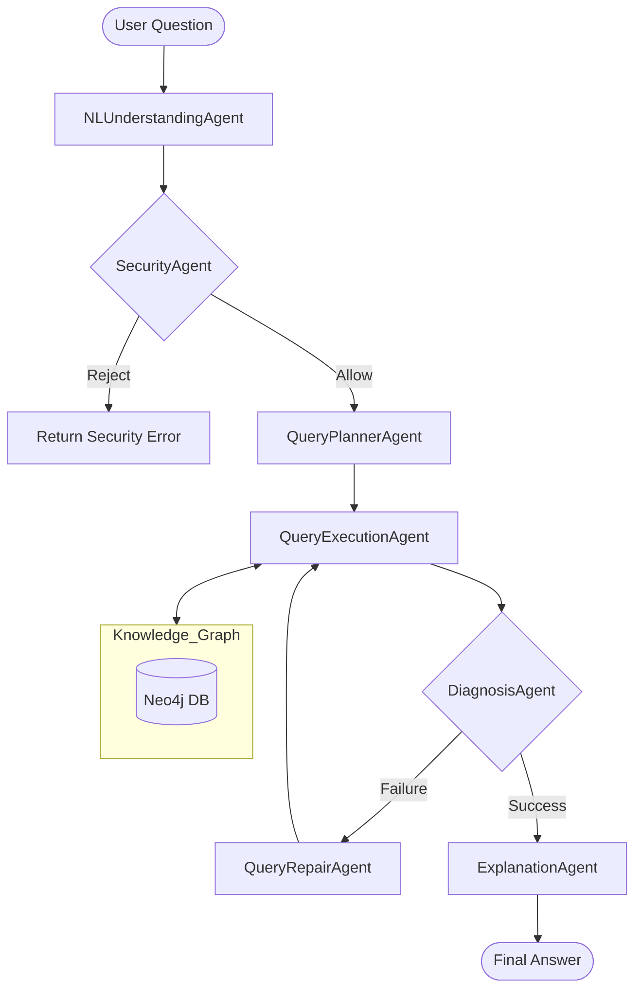

# NCU Regulation Multi-Agent QA System

基於 **Knowledge Graph (Neo4j)** 與 **Multi-Agent RAG** 架構的大學校規問答系統。該系統利用本地大語言模型 (LLM, Qwen 2.5-3B) 配合知識圖譜檢索，精準回答關於國立中央大學（NCU）各項行政與考試規範的問題。

---

## 1. 環境建立
- Python 3.11
- Docker desktop

### 資料庫建置 (Docker)
系統使用 Neo4j 圖資料庫儲存法規條文與其關聯。
```bash
# 在終端機輸入
docker run -d --name neo4j -p 7474:7474 -p 7687:7687 -e NEO4J_AUTH=neo4j/password neo4j:latest

# 打開瀏覽器至 http://localhost:7474.
# user: neo4j / password: password
```

### 虛擬環境設置
```bash
# 建立虛擬環境
python -m venv venv

# 啟動虛擬環境 (Windows)
.\venv\Scripts\activate

# 安裝套件
pip install -r requirements.txt
```

### 執行步驟
```bash
python setup_data.py
python build_kg.py
# 測試個別問題
python query_system_multiagent.py
python auto_test_a5.py
```
---

## 2. Architecture Diagram



---

## 3. Agent Responsibilities

本系統將處理流程拆解為七個核心角色，每個角色負責處理特定的語義或邏輯任務：

| Agent 名稱 | 角色職責 | 核心技術邏輯 |
| :--- | :--- | :--- |
| **NLUnderstanding** | **語義解析核心** | 深度提取關鍵字與數字，識別 **Target Unit**（如：`minutes`, `NTD`, `grade points`）並定義問句類型。 |
| **Security** | **安全守門員** | 針對惡意指令（如 `delete`, `drop`, `bypass`）進行即時攔截，確保資料庫與系統安全性。 |
| **QueryPlanner** | **檢索規劃師** | 根據意圖動態擴展關鍵字，並利用 **強力加權搜尋 (^5)** 強化數字與物理單位的匹配。 |
| **QueryExecution** | **資料執行官** | 負責與 Neo4j 圖資料庫交互，執行讀取操作並完整提取節點內容與 Rule 邏輯。 |
| **Diagnosis** | **品質檢驗員** | 檢查檢索結果是否有效，決定是否需要觸發二次修復搜尋流程。 |
| **QueryRepair** | **自動救援機** | 當初次檢索失敗時，執行更模糊的語義搜尋或主題重對齊（Topic Alignment）以嘗試召回。 |
| **Explanation** | **邏輯判官** | 執行最終生成。負責「數位衝突比對」、強制標註出處 `[Article X]`，並將圖譜邏輯轉化為自然語言。 |

---

## 4. Pipeline

1. **意圖與安全階段**: `NLUnderstandingAgent` 解析問題，確定用戶預期答案是「時間」、「金額」還是「許可」。`SecurityAgent` 同步檢查是否包含危險指令。
2. **檢索規劃階段**: `QueryPlannerAgent` 根據 NLU 提供的 `target_unit` 生成包含強力 Boost 權重的 Cypher 語法。例如搜尋 `minutes~^5` 確保時間相關條文權重最高，防止被雜訊覆蓋。
3. **執行與診斷階段**: `QueryExecutionAgent` 從圖譜撈取 Top 20 相關節點。`DiagnosisAgent` 檢查資料品質。
4. **自動修復階段**: 若檢索為空，`QueryRepairAgent` 會自動切換至更廣域的搜尋模式進行補救。
5. **邏輯生成階段**: `ExplanationAgent` 將檢索到的 Context 進行結構化處理，強行比對數字（如 30 vs 40 分鐘），並嚴格要求格式化輸出。

---

## 5. Challenges

* **檢索偏移 (Retrieval Drift)**
  * **挑戰**: 搜尋「考試」卻出現大量的「學分」或「退學」雜訊，導致正確法規被排擠到 Top 10 之外。
  * **解決**: 引入 **Target Unit** 機制，在 Planner 階段對特定的物理單位（如分鐘、金額）進行權重補償（Boost ^5），確保精準命中。

* **模型逃避行為 (Model Evasion)**
  * **挑戰**: LLM 初期傾向回答 "Not specified" 以規避判斷風險。
  * **解決**: 在 Explanation 階段使用「強約束 Prompt」，明確告知模型：如果你在資料中看到數字或懲罰詞，就必須回答，不准忽視。

* **數位比對邏輯 (Numeric Logic)**
  * **挑戰**: 單純文字匹配無法判斷「30分鐘後能不能離場」。
  * **解決**: 強制 Explanation Agent 執行 **Logic Check**，將使用者提問數值與法規限值進行比較，主動指出衝突。

---

## 6. Findings

* **實體提取決定成功率**: 當 NLU 能精確抓出問題的「計量單位」時，後續 Planner 的搜尋準確度有顯著提升。
* **出處標註大幅減少幻覺**: 要求模型必須寫出 `[Article X]` 會引導 LLM 在生成時重新校對檢索內容，有效降低虛構法規的可能性。
* **結構化 Context 的優勢**: 在 Explanation 階段將 `Action -> Result` 的邏輯鏈條（從圖譜關係中提取）直接呈現給 LLM，能幫助模型更快速理解複雜的懲罰與獎勵條款。
* **多 Agent 協作的魯棒性**: 透過 Diagnosis 與 Repair 的設計，系統在面對口語化或非標準化提問時，具備更好的容錯與修正能力。
